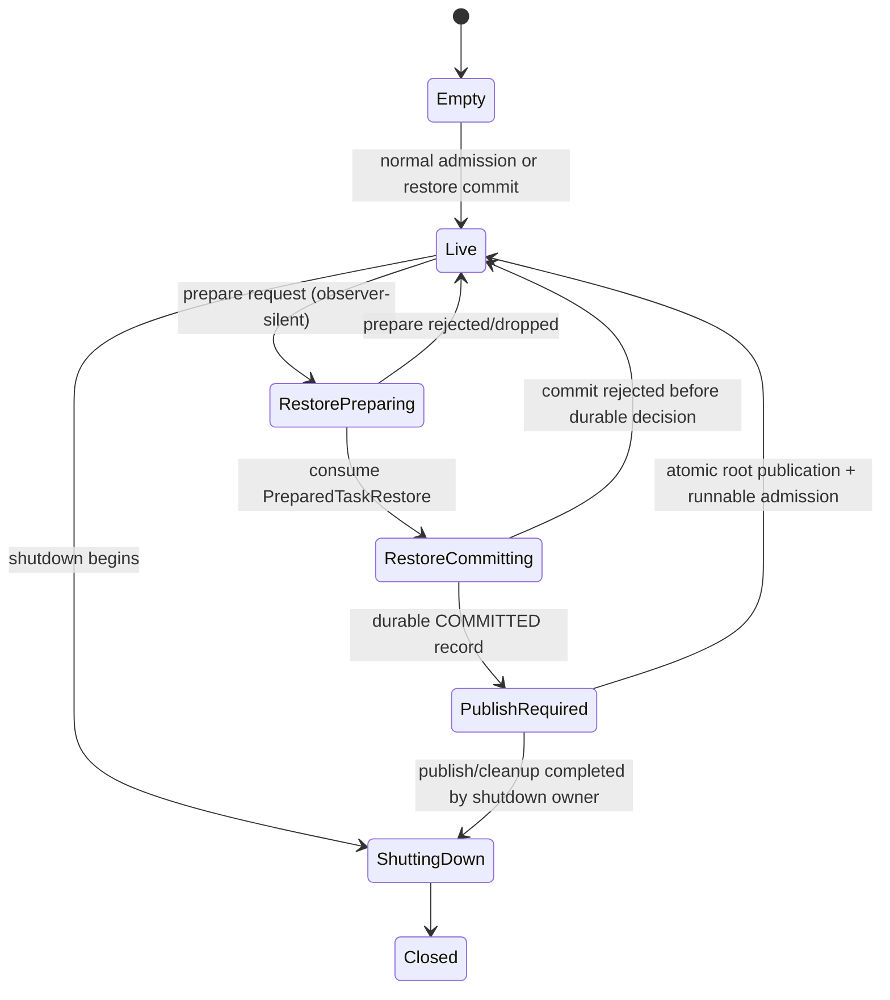

# Normative design: runtime task coordinator and two-phase restore

## 1. Scope and outcome

This contract introduces one coordinator-owned restore path for a persisted runtime task cohort. It closes four failure classes:

1. a decoded task becoming visible before every member of its batch is valid;
2. a snapshot and reconstructed handle batch losing identity/isomorphism;
3. process failure making a committed restore indistinguishable from an uncommitted attempt;
4. multiple owners independently deciding whether a restored task exists.

The design is intentionally batch-oriented. A restore either publishes the complete, sealed cohort or publishes none of it.

## 2. Authority model

| Authority | Sole owner | May read | May decide/mutate |
|---|---|---|---|
| Persisted bytes and durable restore decision | `TaskPersistence` / `TaskRestoreJournal` | coordinator restore code | journal implementation only |
| Installed task identity and generation | `RuntimeTaskCoordinator` | handles, scheduler, match consumers | coordinator only |
| Published batch root | `RuntimeTaskCoordinator` | lock-free/read-guard readers | coordinator commit path only |
| Per-task execution state after publication | coordinator-owned `RuntimeTaskCell` | scheduler/handle views | task cell under coordinator lifecycle |
| Prepared task graph | `PreparedTaskRestore` | commit path | prepare builder until moved into commit |
| Handle view | `RuntimeTaskHandle` | caller | cannot install/remove/restore a task |
| Match substrate | published batch root | matcher | built detached, moved atomically; no independent restore |

`TaskPersistence` answers “what durable record exists?” The coordinator answers “what runtime object is currently published?” Neither duplicates the other's authority.

## 3. Aggregate boundary

The atomically published value is a complete `PublishedRuntimeTaskBatch`:

```rust
pub(crate) struct PublishedRuntimeTaskBatch {
    pub restore_id: RestoreId,
    pub source_snapshot: RuntimeTaskSnapshotId,
    pub source_digest: RuntimeTaskSnapshotDigest,
    pub coordinator_epoch: CoordinatorEpoch,
    pub tasks: Box<[RuntimeTaskCell]>,
    pub task_index: TaskIdentityIndex,
    pub handles: RuntimeHandleBatch,
    pub match_substrate: RuntimeMatchSubstrate,
    pub runnable_seed: Box<[RuntimeTaskId]>,
    pub batch_digest: RuntimeTaskBatchDigest,
}
```

Normative invariants:

- `tasks.len() == handles.len() == snapshot.task_count`.
- Slot `i` in snapshot, task cells, handle batch, and canonical digest refers to the same `(TaskId, Generation)`.
- Every index/reference points within the batch or to an explicitly admitted external root.
- `batch_digest` covers task identities, plan seals, captured values, match transcript/coverage seal, and canonical slot order.
- The batch is immutable after publication except for task-local execution state behind its existing synchronization primitive.
- Readers obtain either the old complete root or the new complete root; no mixed generation is observable.

## 4. Coordinator lifecycle



`RestorePreparing` is conceptual; the live coordinator is not locked for the duration. Only a captured `base_epoch` and immutable context are read. `RestoreCommitting` is serialized by `restore_serial`, not by holding every task lock.

## 5. Public two-phase protocol

### 5.1 Phase A — prepare

`prepare_restore` performs all fallible decode and semantic validation against detached state:

1. read the exact snapshot envelope and verify framing/checksum/version;
2. verify snapshot identity, role/root provenance, catalog/ABI digest, and source seal;
3. decode the canonical task rows in canonical slot order;
4. rebuild task plans and semantic children; verify every plan seal before accepting references;
5. rebuild the runtime-handle batch as detached handle slots, preserving task generation identity;
6. rebuild generic match substrate and complete transcript/coverage closure;
7. validate task graph referential integrity, admitted external roots, and lifecycle states;
8. compute `RuntimeTaskBatchDigest` independently from the stored digest and compare;
9. capture the target `CoordinatorEpoch` and reject known collisions;
10. return a non-`Clone`, `#[must_use]` prepared value.

Prepare **must not**:

- insert into the coordinator task index;
- return public runtime handles;
- register wakers or scheduler queues;
- invoke user code, external producers, or task poll functions;
- append a durable committed decision;
- mutate the currently published match substrate;
- make a restored task visible through lookup, metrics labelled as live, or cancellation APIs.

### 5.2 Phase B — commit

`commit_restore` consumes the prepared value and executes this exact order:

| Step | Operation | Durable? | Externally visible? | Failure disposition |
|---:|---|---:|---:|---|
| C1 | acquire coordinator `restore_serial` gate | no | no | return busy/shutdown before mutation |
| C2 | recheck coordinator ID, epoch, identity collisions, and idempotency token | no | no | deterministic conflict/no mutation |
| C3 | append+sync `PREPARED` journal record | yes | no | retry or return I/O error; no live mutation |
| C4 | move batch into coordinator `pending_publication` slot | no | no | invariant failure; journal remains replayable PREPARED |
| C5 | append+sync `COMMITTED` record | yes | no | remove hidden pending value and replay PREPARED, or retain it for same-process retry; never publish |
| C6 | atomically replace/publish the batch root and advance epoch | decision already durable | yes, all at once | infallible memory operation by construction |
| C7 | seed runnable queue and release deferred wakes | no | yes | queue failure becomes coordinator-fatal/recovery work, not commit rollback |
| C8 | return stable `RestoreReceipt`; optional journal compaction/ACK is non-authoritative | no | yes | lost reply is handled by idempotent token replay |

The semantic commit point is the synced `COMMITTED` record. Runtime visibility follows immediately through a deliberately infallible publication path. There is no API state in which a caller may legally treat only some tasks as restored.

## 6. Cross-contract reconciliation

### 6.1 Handle-batch/snapshot isomorphism

Prepare constructs `PreparedRuntimeHandleBatch` from the snapshot's canonical slot table. It does not allocate a second identity. Commit converts its slots into public handles only while assembling the published root. Lookup uses `(TaskId, Generation)` and the coordinator epoch, preventing ABA reuse.

### 6.2 Task-plan semantic children and seal

A restored plan is accepted only after the same canonical semantic child encoder used by normal task admission reproduces the stored plan seal. Restore-specific encoders or “close enough” field hashing are forbidden.

### 6.3 Generic match transcript and coverage closure

The detached match builder must prove complete transcript/coverage closure for the restored generic match state. Any uncovered case, unknown runtime carrier, or transcript digest mismatch is a prepare error; it cannot be deferred to first match execution.

### 6.4 Structural/nominal runtime carriers

Carrier decoding reuses the project-owned carrier enum and extends its original `impl` when restore behavior is missing. The restore module must not introduce a parallel carrier enum, extension trait, or string-tag switch.

## 7. Invariant catalog

| ID | Normative invariant | Enforcement points |
|---|---|---|
| RTC-I01 | One coordinator owns each published `(TaskId, Generation)`. | prepare collision scan; commit recheck; index constructor |
| RTC-I02 | A prepared batch is observer-silent. | private fields; no public handle conversion; lookup test |
| RTC-I03 | Commit consumes the prepared batch exactly once. | non-`Clone` type; by-value API |
| RTC-I04 | Snapshot/handle/task slots are bijective and canonically ordered. | decoder; batch constructor; digest; property test |
| RTC-I05 | No public task references a detached task cell. | handle state typestate; publication constructor visibility |
| RTC-I06 | Durable `COMMITTED` precedes publication. | commit function order; fault-injection hooks |
| RTC-I07 | Same restore token never names two digests. | journal uniqueness check; corruption error |
| RTC-I08 | A committed restore is eventually published exactly once. | startup replay; idempotent publication receipt |
| RTC-I09 | No disk I/O/user callback/task poll under publication lock. | API separation; lock-order test/review gate |
| RTC-I10 | Unknown versions/features mutate nothing. | envelope gate before builder allocation/admission |
| RTC-I11 | Shutdown cannot discard a durable commit. | non-cancellable completion guard; recovery marker |
| RTC-I12 | Match substrate and task table share a publication epoch. | single aggregate root |
| RTC-I13 | Existing live task identity is never silently overwritten. | commit conflict table |
| RTC-I14 | Optional ACK/compaction never changes restore truth. | journal reducer |
| RTC-I15 | Production behavior remains unchanged until implementation lands behind the designated gate. | design-only package; rollout plan |

## 8. Conflict and idempotency table

| Existing journal/runtime state | Incoming token/digest | Result |
|---|---|---|
| none, target IDs free | new/new | prepare then commit |
| PREPARED, no published batch | same/same | resume commit from validated record or rebuild and verify equal |
| COMMITTED, not yet published in this process | same/same | publish, return original receipt |
| published | same/same | no-op success, same receipt |
| any | same/different | `RestoreTokenDigestMismatch` corruption |
| published IDs overlap | different/any | `TaskIdentityConflict` |
| commit in progress | different/any | `RestoreBusy` or await gate according to caller policy; never interleave |
| target epoch changed since prepare | new/any | `StaleCoordinatorEpoch`; caller re-prepares |
| coordinator shutting down before durable commit | new/any | `CoordinatorShuttingDown`; no mutation |
| shutdown after durable commit | same/same | shutdown owner completes publication or startup replay does |

## 9. Explicit non-goals

- Restoring arbitrary partial subsets from a sealed batch.
- Rebinding a snapshot to a different coordinator identity without an explicit migration tool.
- Serializing executor internals, wakers, locks, `Arc` addresses, or active stack frames.
- Converting persistence corruption into a recoverable task-level result.
- Hiding an ABI/catalog mismatch behind a best-effort compatibility adapter.
